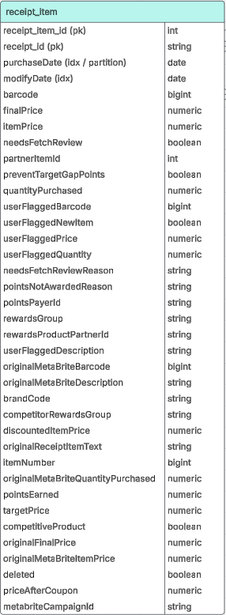

# Fetch Assessment

# Schema Discovery

```sql
import json
import pandas as pd
from collections import defaultdict

# Load the JSON file
file_path = "./receipts.json"
records = []
with open(file_path, "r") as f:
    for line in f:
        records.append(json.loads(line))
df_receipts = pd.json_normalize(records)
print("Receipts Schema: ----------------------------")
print(df_receipts.info())

#print(build_table_schema(df_receipts))

df_receipts['rewardsReceiptItemList'].fillna('[]', inplace=True)
df_receipt_items = pd.json_normalize(df_receipts['rewardsReceiptItemList'].explode())
df_receipt_items = pd.concat([df_receipts[['_id.$oid', 'purchaseDate.$date', 'modifyDate.$date']].loc[df_receipts.index.repeat(df_receipts['rewardsReceiptItemList'].apply(len))].reset_index(drop=True), df_receipt_items], axis=1)
print("receipt lines schema: -----------------------")
print(df_receipt_items.info())

```



# Model Design

The model implements a **medallion design pattern,** promoting better modularization and reusability of transformation logic while incrementally enriching the value of the data at each stage of the process. It follows a mostly **ELT** workflow that leverages a **PostgreSQL** data warehouse to perform **SQL** transformations and pre-aggregations for downstream consumption:

- **Bronze Layer**: The models in this layer serve as the ground source of truth, preserving the original format of the source data. Raw data is deduplicated and ingested from operational systems into the Data Warehouse. It is assumed that the raw json data is streamed into a time-partitioned cloud storage bucket that can be leveraged for efficient incremental loads into the warehouse. For this project, I implemented a very minimal Python transformation layer here to convert and ingest the json data into the warehouse, where additional schema discovery and transformations can be performed.
- **Silver Layer**: The data from the bronze layer is cleaned and standardized, structuring data into a more efficient and consumable format for downstream processing. This layer offers a set of reusable models that can be easily utilized and extended by other engineers and technically proficient end-consumers for future applications. If the project scope extends to multiple operational systems, the silver layer can also serve to encapsulate fragmented business entities into a single module. In this particular case, the primary silver model is called `receipt_items`, which is generated by flattening the nested receipt item list into its own table.
- **Gold Layer**: The necessity of this layer is highly dependent on the technical proficiency of the target end-users. For a non-technical user base, this layer would be used to combines silver layer data into pre-aggregated, analysis-ready models. For this exercise, the target consumer is a non-technical business stakeholder who is expecting direct answers / visualizations to their predetermined questions. Given that self-service analysis is out of scope, I believe the best approach is to simply leverage the silver `receipt_items` model that encompasses all of the included questions and leaves room for extension for future business inquiries. The stakeholder is primarily focused on understanding brand performance and the impact of rewards on consumer behavior over a rolling six month period. Based on that cadence, this model only needs to retain six months of data and will not require extensive processing to generate business value - only requiring a scheduled refresh on a daily / weekly / monthly frequency.  The `receipt` table can be indexed on `modifyDate` for efficient incremental refreshes, and partitioned on `purchaseDate` for efficient historical precomputes. If the scope of analysis expands to beyond the 6 month threshold, then we can easily move to a precompute model, and partition `receipt_items` by date as well. This can effectively serve as a hub for all sales analysis, providing easy extension to future analytic dimensions.

ERD


# Data Quality Issues / Checks

- Unreliable link between `brands` and `receipts`. `receipts` currently do not store `brandId`, the system is only storing the `brands.cpgId` in the receipt items
    - Many brands can share the same `cpgId`
- Not all `userId`’s from receipts table are included in `users` data
    
    ```sql
    select * from bronze.users where id in
    (select distinct user_id from silver.receipt_items where user_create_date is null)
    ```
    
- Receipts with `purchaseDate`, `rewardReceiptStatus` = `‘FINISHED’` have empty `rewardsReceiptItemList`
    
    ```sql
    select * from bronze.receipts where "rewardsReceiptItemList" is null or "rewardsReceiptItemList" = '[]'
    and "purchaseDate" is not null
    ```
    
- Cases in which sum(`receipt_items.finalPrice`) ≠ `receipts.totalSpent`, making it difficult to establish ground source of truth for metrics like Total and Average Spend
    
    ```sql
    with top as (select id as receipt_id, "totalSpent" from bronze.receipts),
    detailed as (select receipt_id, sum(final_price) item_total_spent from silver.receipt_items group by receipt_id)
    select * from top 
    inner join detailed using (receipt_id)
    where "totalSpent" != item_total_spent
    ```
    
- `receipts.purchasedItemCount` ≠ length(`receipts.rewardsReceiptItemList`)
    
    ```sql
    with silver as (
    	select receipt_id, count(*) silver_count from silver.receipt_items group by receipt_id
    ),
    bronze as (
    	select id as receipt_id, "purchasedItemCount" bronze_count from bronze.receipts 
    	where "rewardsReceiptItemList" is not null and "rewardsReceiptItemList" != '[]'
    )
    select * from silver 
    inner join bronze using (receipt_id)
    where silver_count != bronze_count
    ```
    
- Validate `silver.receipt_items` against `bronze.receipts`
    
    ```sql
    
    -- identify any missing receipt_ids 
    select id from bronze.receipts 
    where "rewardsReceiptItemList" is not null and "rewardsReceiptItemList" != '[]'
    nd id not in (select distinct receipt_id from silver.receipt_items)
    
    -- compare counts
    with silver as (
    	select 'audit' as task, count(distinct receipt_id) silver_count from silver.receipt_items
    ),
    bronze as (
    	select 'audit' as task, count(distinct id) bronze_count from bronze.receipts 
    	where "rewardsReceiptItemList" is not null and "rewardsReceiptItemList" != '[]'
    )
    select * from silver 
    inner join bronze using (task)
    where silver_count != bronze_count
    ```
    
- Receipt items don’t have a reliable ObjectId
- users and brands don’t have modifyDate, adding complexity to incremental updates for `Users` and `Brands`

# Limitations

This implementation does not contain infrastructure or workflow orchestration components, as I believe it is essential to prioritize data assessment and value confirmation of the initial model POC. Given that there are several existing data integrity issues, I’d like to get those in order first. The models are implemented in such a way that offers plenty of room for scaling via indexing, native partitioning, and incremental precomputing. The models are extensible and simple, facilitating collaboration with other teams if needed. For orchestration, PostgreSQL has a convenient extension, `pg_cron` that can facilitate simple scheduled precompute jobs. If the dependency management between jobs becomes too cumbersome, that can always be migrated to a separate workflow orchestration tool. For versioning and model management, we can utilize a combination of tools like Github Actions and dbt. 

# Stakeholder Communication

Re: Sales Analysis 

Hello {Stakeholder name here},

Hope your week is going well! Good news: I’ve examination of the data you sent over, and have created a model to answer the questions you had! Bad news: there are a few issues that I’ve identified with the data, and wanted to address them with you before moving forward.

Context:

Many of the questions are related to brand performance. The only way to link brand data to the receipt data is through the items on the receipt, as a single receipt can be comprised of items from different brands. Since the item-level data is very relevant for this analysis, I believe it is essential that we have the ability to identify and reconcile financial discrepancies between the receipt total and its constituent items. Based on this premise, I conducted cross-model integrity checks and determined:

- There are discrepancies between the receipt items and the receipt data, most importantly regarding the total spend amount and number of items purchased.
- There is currently no reliable way to link brand data with receipt data, which greatly inhibits our ability to properly determine brand engagement. There is a `brandCode` that is attached directly to the receipt item data, but it is not consistently populated.
- There are users missing from the dataset. The receipts come through with an associated user ID, but those entries aren’t present in the users data.

Current Blockers:

- When addressing discrepancies between the receipt and receipt item data, I need help determining which dataset should be treated as he ground source of truth. This will help ensure consistency in our analysis across different granularities (top level: receipt, detailed level: receipt items).
- To properly leverage the system’s existing brand catalog in our sales analysis, I need to know who I can coordinate with to ensure the unique, system brand IDs are included in the receipt data further upstream. I would really appreciate it if you could help me identify the right team to approach.
- Ingesting the remaining users data will enable more accurate analysis.

Based on the monthly analysis cadence and my prior project experience, I’m confident this light-weight model will scale well with our business needs, and can continue to operate at a terabyte scale. Below are some additional questions I have about the data that will help provide context in building future analytic models. 

Additional Questions:

- Should sales metrics include receipts that have a purchase date, but do not have any attached items?
- Is there any action required for receipt items that are marked for fetch review?
- What is MetaBrite?
- There are several attributes in the receipt items data that mention a concept of user flagging (`userFlaggedBarcode`, `userFlaggedPrice`, etc.) - is that relevant for business analysis?
- Is there a significant distinction between coupon item price and discount item price?

Looking forward to your feedback! 

Best,

Ethan Kwan
